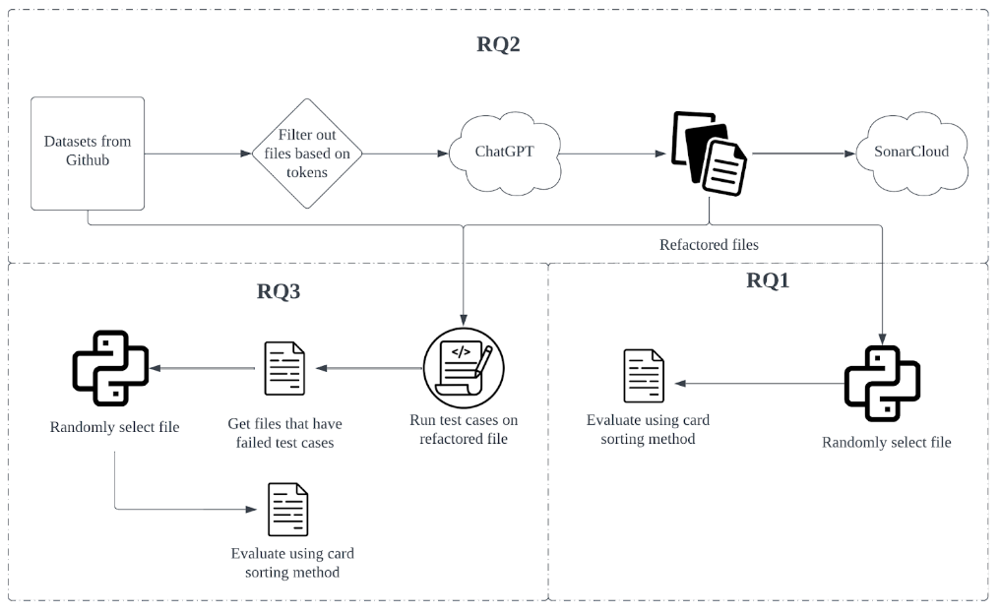

# Exploring ChatGPT: Evaluating its Code Generation Prowess for Refactoring Diverse Codebases

This repository contains the automation code, before refactored code from Github, after refactored code from Github, test cases for the code and result from SonarCloud(Static Analysis Tools) for our paper: "Exploring ChatGPT: Evaluating its Code Generation Prowess for Refactoring Diverse Codebases"

# Quick Link

+ [Overview](#overview)
+ [Getting Started](#getting-started)
+ [Results](#results)
  
# Overview

We have provided result of the SonarCloud analysis.
We also provide the refactored code by ChatGPT to generate technical analysis on the code in the paper.
The following figure provide the overall workflow for the project


# Getting Started
## Datasets

Can be accessed through the file ```repo.xlsx```. 

## SonarCloud

Navigate to the ```sonar-project.properties``` and ```.github/workflow/sonarcloud.yml``` to obtain the github action automation script. 

To find more information visit: https://github.com/SonarSource/sonarcloud-github-action

## Run script for python

To run the python script for refactoring code using OpenAI API, use the following command 

```
python chatgpt_code.py
```

To run the python script for analysis in SonarCloud, use the following command 

```
python webapi.py
```

# Results
Latest results can be accessed through the file ```summary.xlsx ```.
The SonarCloud analysis of this repo can be found in this link: https://sonarcloud.io/summary/new_code?id=Winson-Foo_Empirical_Evaluation_of_Commercial_Code_Generation_Models&branch=test

## Test Case
### Python
To run python test case change the directory to ```Testcase/QuixBugs``` make sure the folder contain test case for python and run the following command

```
pytest .\test_after_refactor_1.py
```

To test other file change the ```test_after_refactor_1```

### Javascript
To run python test case change the directory to ```Testcase/javascript-algorithms``` make sure the folder contain test case for javascript and run the following command
```
npm test -- --e 'After_Refactor_1' --runTestsByPath [your_directory]\Empirical_Evaluation_of_Commercial_Code_Generation_Models\Testcase\javascript_algorithms_1__test__\After_Refactor_1.test.js
```
To test other file change the ```After_Refactor_1```

### Java
To run Java test case change the directory to ```After_Refactor_1/QuixBugs(Java) ``` make sure the folder contain test case for java and run the following command

```
gradle build
```

Then go to the directory ```After_Refactor_1/QuixBugs(Java)/build/reports``` and click on index.html to see the full report for the test case
